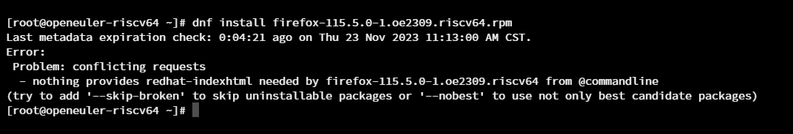
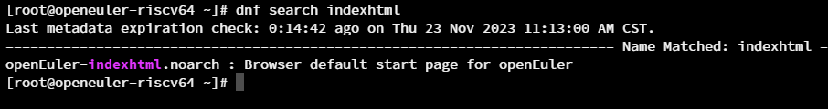
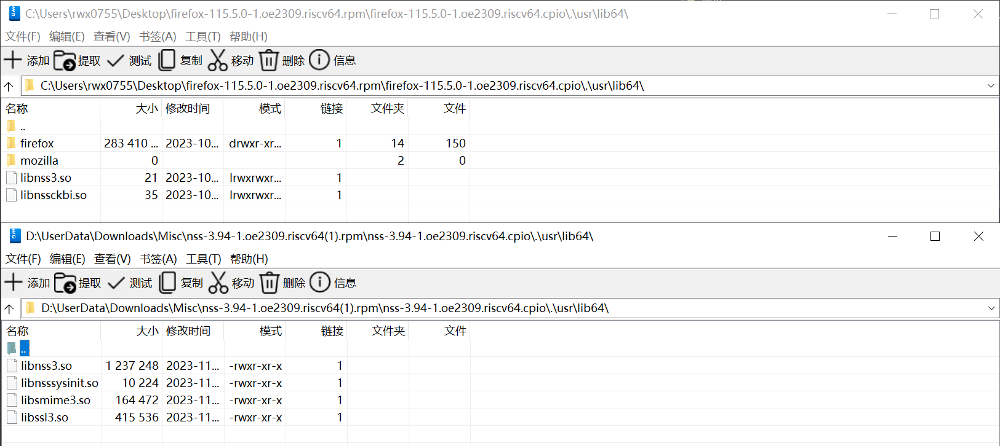
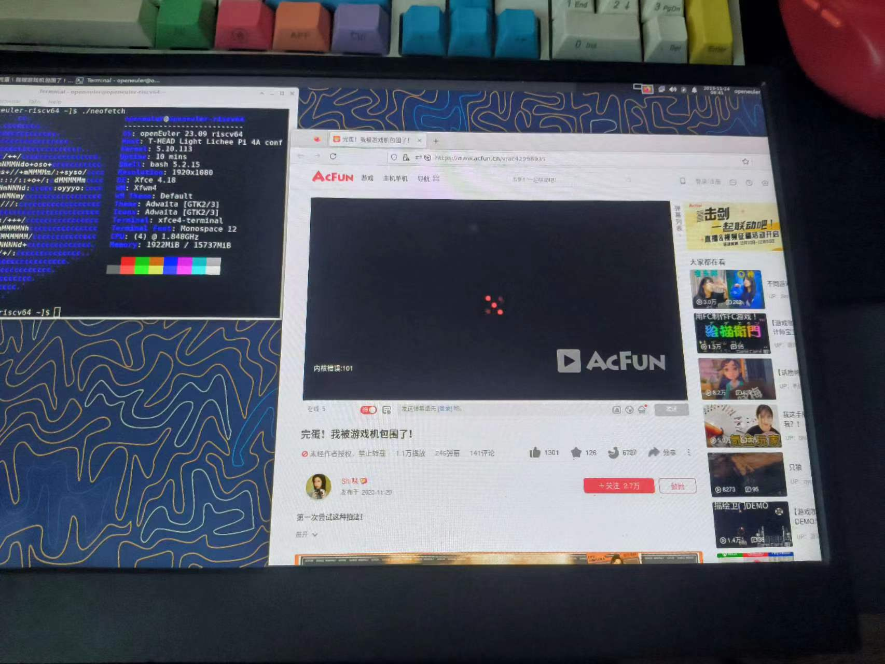
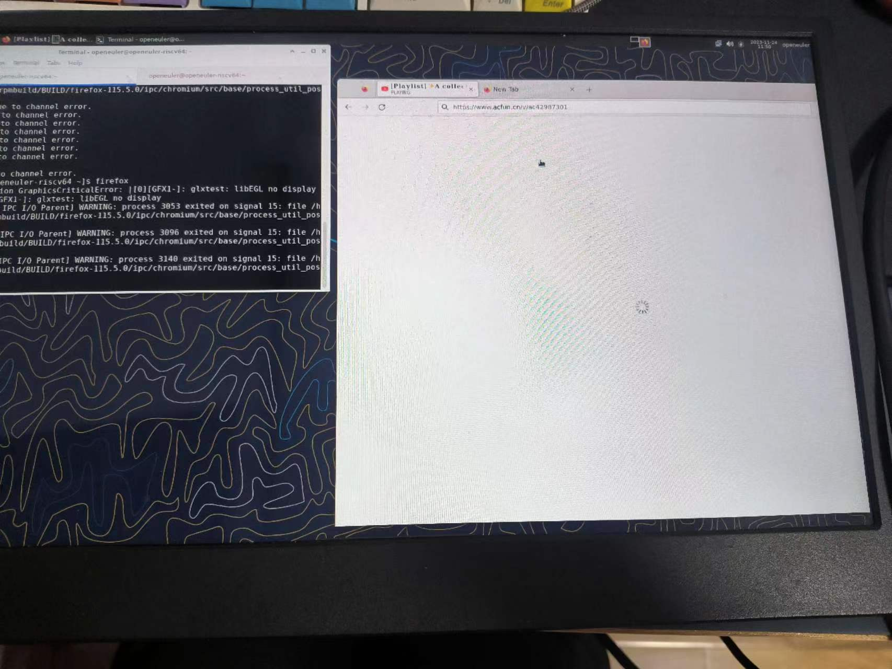

# Firefox 115 ESR 测试

## 测试环境

openEuler 23.09 RISC-V testing, QEMu & LPi4A 16G

Firefox 115 ESR, [个人仓](http://124.70.71.209:82/openEuler:/23.09:/RISC-V:/Jingwiw/standard_riscv64/riscv64/)

## 测试方法

0. 前置依赖：安装 Xfce 桌面

```bash
sudo dnf install xorg-* xfwm4 xfdesktop xfce4-* xfce4-*-plugin network-manager-applet lightdm lightdm-gtk
sudo systemctl enable --now lightdm
```

若 lightdm 启动后未能显示图形界面，重启系统。

1. 安装 Firefox

```bash
curl -LO http://124.70.71.209:82/openEuler:/23.09:/RISC-V:/Jingwiw/standard_riscv64/riscv64/firefox-115.5.0-2.oe2309.riscv64.rpm
curl -LO http://124.70.71.209:82/openEuler:/23.09:/RISC-V:/Jingwiw/standard_riscv64/riscv64/nss-3.94-1.oe2309.riscv64.rpm
curl -LO http://124.70.71.209:82/openEuler:/23.09:/RISC-V:/Jingwiw/standard_riscv64/riscv64/nss-softokn-3.94-1.oe2309.riscv64.rpm
curl -LO http://124.70.71.209:82/openEuler:/23.09:/RISC-V:/Jingwiw/standard_riscv64/riscv64/nss-util-3.94-1.oe2309.riscv64.rpm
sudo dnf install -y firefox*.rpm nss*.rpm
```

2. 启动 Firefox

从终端运行 `firefox` 或直接点击 xfce 桌面上的浏览器 Logo。

3. 打开 bilibili 播放任意视频。

4. 尝试切换标签页。

## 预期结果

Firefox 正常安装，视频正常播放，标签页切换正常。

## 实际结果

Firefox 软件包安装需要应用替代方法：

1. 默认依赖了 `redhat-indexhtml` 而不是 `openEuler-indexhtml`




2. Firefox 软件包中集成的 libnss 与系统库冲突：



3. 不开启 ffmpeg 的情况下，H264 软解码无法使用（VP9, AV1 软解正常工作）：



4. 开启 ffmpeg 的情况下，H264 软解码只能播放短暂一会，而后会卡死

5. 切换标签页会卡在加载（转圈）



## 其他内容

Firefox 115 修复后，以上问题均已解决，目前只需要在 openEuler 23.09 RISC-V preview 中直接安装即可：

```bash
sudo dnf install -y firefox
```