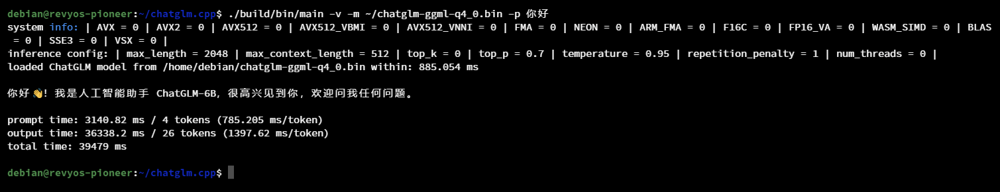

# InferLLM on Milk-V Pioneer

### 前置条件

- 硬件：Milk-V Pioneer v1.3, 4*32G DDR4-3200 REG ECC
- 系统：RevyOS 20240119
    - 需要开启 c910v 仓库并安装 T-Head 优化工具链

### 操作步骤

#### 开启 T-Head 优化 GCC

> 参考 [RevyOS Docs / 如何启用 T-Head 优化 GCC](https://revyos.github.io/docs/build/debian/enable_optimization_gcc/)

```bash
# 增加优化源
sudo sed -i '1ideb https://mirror.iscas.ac.cn/revyos/revyos-c910v/ revyos-c910v main' /etc/apt/sources.list
# 更新软件
sudo apt update && sudo apt upgrade -y
# 安装 gcc-10
sudo apt install -y build-essential gcc-10 g++-10
# 卸载不再需要的其他软件包，如 gcc-13
sudo apt autoremove --purge
# 重启避免其他问题
sudo reboot
```

#### 构建 InferLLM

```bash
git clone --depth=1 https://github.com/MegEngine/InferLLM
mkdir build
cd build
cmake .. -DINFER_ARCH=rvv0p7
make -j$(nproc)
```

#### 获取模型并运行 InferLLM

从此处获取模型：

[kewin4933/InferLLM-Model](https://huggingface.co/kewin4933/InferLLM-Model/tree/main)

```bash
curl -LO https://huggingface.co/kewin4933/InferLLM-Model/resolve/main/chatglm-q4.bin?download=true
./chatglm -m chatglm-q4.bin -t 64 --mmap
```

[](https://asciinema.org/a/G08ElLBG1BNBLCdJFSz0Nfp3I)

#### 对比 | 无 Vector 加速

使用 ChatGLM.cpp 项目，rv64gc / GCC 13 构建，模型来自 chatglm-6B-GGML [(HuggingFace)](https://huggingface.co/Xorbits/chatglm-6B-GGML/blob/main/chatglm-ggml-q4_0.bin)

```log
debian@revyos-pionner: ~/chatgtm.cpp$ ./build/bin/main -v -m ~/chatgtm-ggml-q4_0.bin -p 你好
system info: | AVX2 = 0 | AVX512 = 0 | AVX512_VNNI = 0 | FMA = 0 | NEON = 0 | ARM_FMA = 0 | F16C = 0 | F16_VA = 0 | WASM_SIND = 0 | BLAS = 0 | SSE = 0 | VSX = 0 |
inference config: | max_length = 2048 | max_context_length = 512 | top_k = 0 | top_p = 0.7 | temperature = 0.35 | repetition_penalty = 1 | num_threads = 0 |
loaded ChatGLM model from /home/debian/chatglm-ggml-q4_0.bin within:885.054 ms
你好👋！我是人工智能助手 ChatGLM-6B，很高兴见到你，欢迎问我任何问题。

prompt time: 3140.82 ms / 4 tokens (785.205 ms/token)
output time: 36338.2 ms / 26 tokens (1387.62 ms/token)
total time: 39479 ms
```


