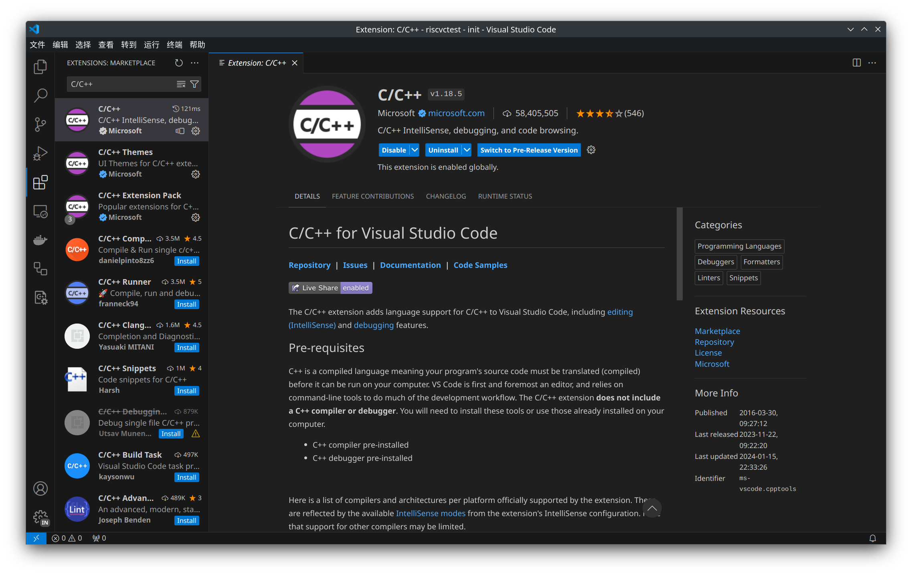
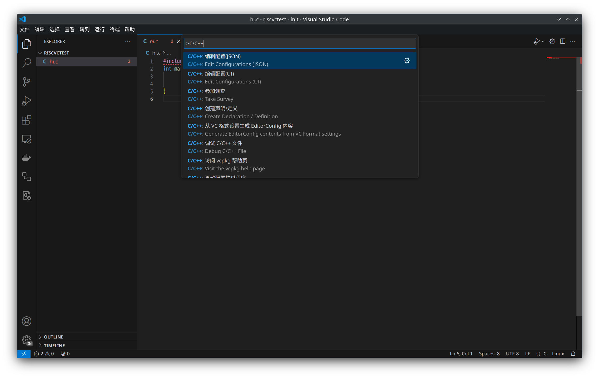
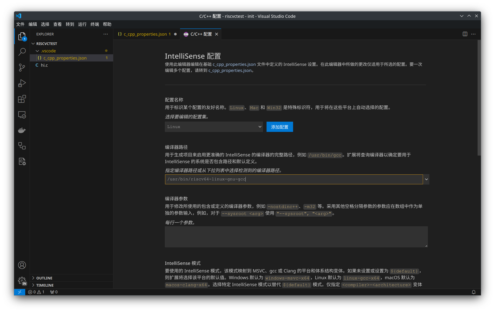
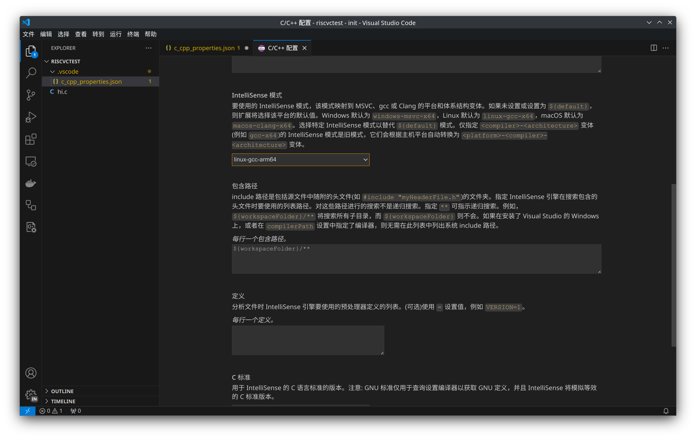

## 基于 VSCode 的 C 语言交叉编译与调试

> [!WARNING]  
> VSCode C/C++ 插件的 IntelliSense 目前并不支持 RISC-V 作为 target，需要手动编写配置文件。

以下内容仅供参考。

1. 安装 C/C++ 插件：[Visual Studio Marketplace](https://marketplace.visualstudio.com/items?itemName=ms-vscode.cpptools) 或 `ext install ms-vscode.cpptools`

2. 打开 C/C++ 插件配置界面，指定编译器位置（此处为 Arch Linux 下的 `riscv64-linux-gnu-gcc` 包，gcc 位置为 `/usr/bin/riscv64-linux-gnu-gcc`）

3. 选择编译目标平台。

> 目前 VSCode 的 IntelliSense 只支持 x86 / x64 / ARM / ARM64。

