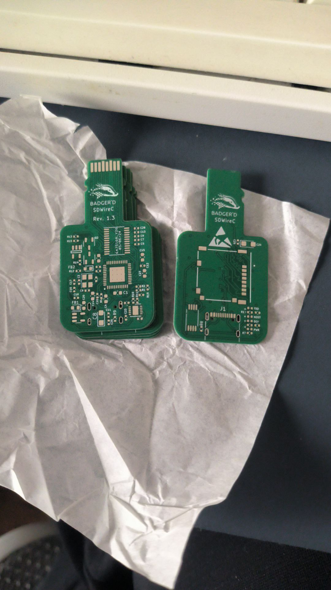

# week 3 / 本周工作

2024.05.06 ~ 2024.05.11

## 操作系统支持矩阵

新增：

- Milk-V Duo S 
    - [NuttX](https://github.com/ruyisdk/support-matrix/commit/f3c5b10fd95dede2a3718d77609ca8dfce392adc)
        - [新版本重新测试](https://github.com/ruyisdk/support-matrix/commit/80c73da428c7c35018f6d8d277c260a6555dafe4)
    - [BuildRoot](https://github.com/ruyisdk/support-matrix/commit/e7836356d5c90cde83cfdf7baa6ed008b9cf5ba2)
    - [Debian](https://github.com/ruyisdk/support-matrix/commit/e7836356d5c90cde83cfdf7baa6ed008b9cf5ba2)

审核实习生提交的 PR：

https://github.com/KevinMX/support-matrix/pull/11

https://github.com/KevinMX/support-matrix/pull/12

https://github.com/KevinMX/support-matrix/pull/13

### 其他内容

#### 硬件自动化测试

[SDWireC](https://github.com/Badger-Embedded/badgerd-sdwirec) PCB 打板，相关元器件已采购，部分元器件国内无货，等待海外采购到货后开始验证工作。

前期调研失误，PCB 厚度错误（1mm -> 0.8mm），microSD 位置打磨后理论上不影响使用，等待海外采购元器件到货后，若测试可用，将重新打板。

PCB

