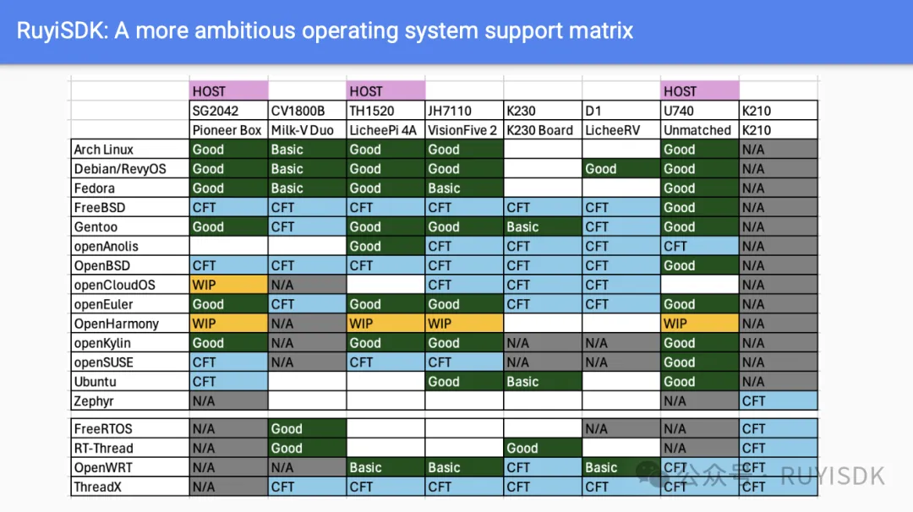
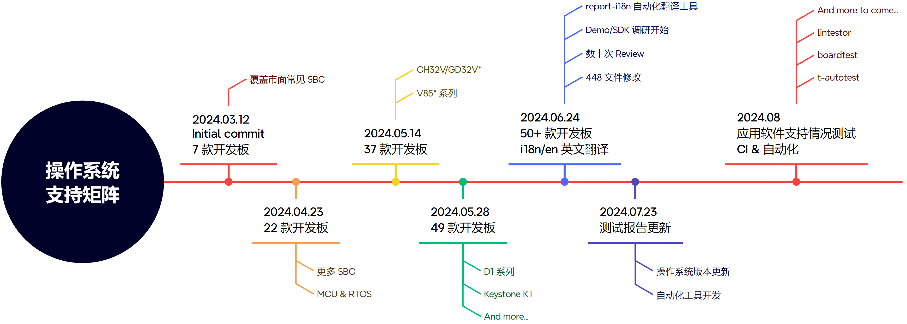
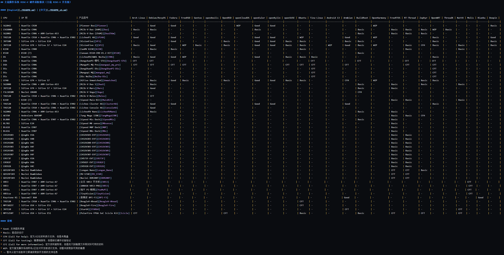
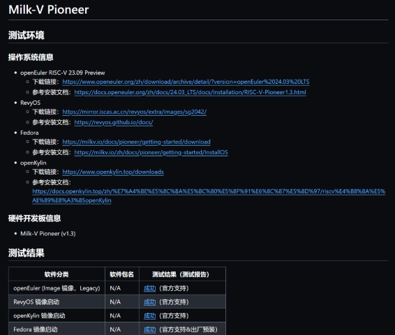
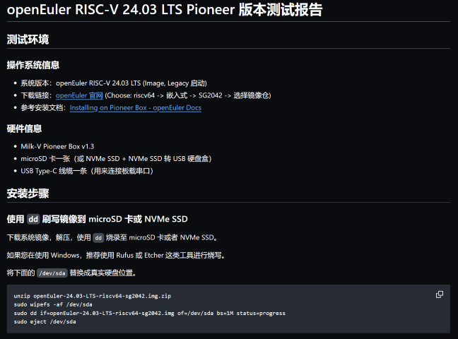
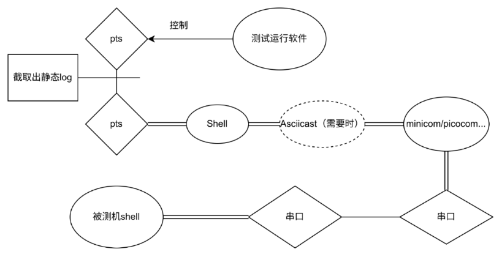
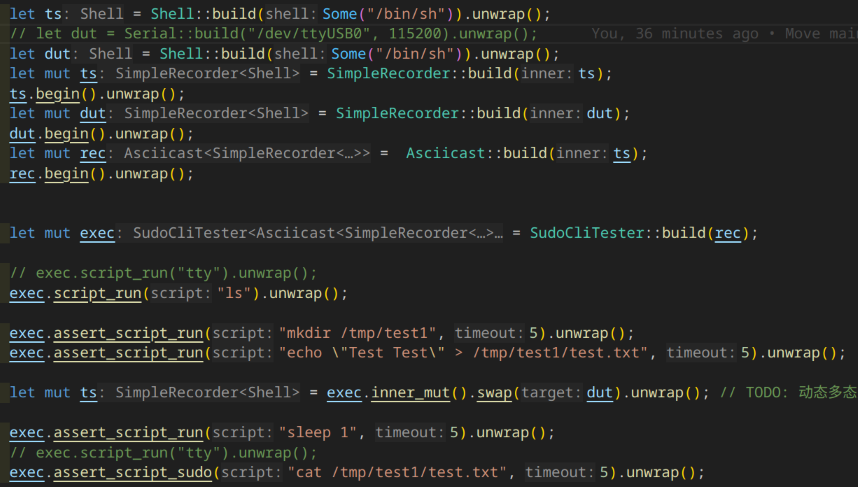

# RISC-V 操作系统支持矩阵

PLCT Lab 测试团队 · 丁丑小队

<!-- _footer: "" -->
<!-- _paginate: "skip" -->

---

# 我是谁 | Who am I

- PLCT Lab 测试团队 · 丁丑小队
- RuyiSDK 操作系统支持矩阵 / P120 Mentor
- Previously: 第三测试小队
- GitHub [@KevinMX](https://github.com/KevinMX)
  - ~~常用 ID 后半截的 MX 其实才是本体~~

---

# 内容概述

- 缘起
- 当下
    - RISC-V 操作系统支持矩阵
        - i18n / 国际化
    - 自动化测试框架
        - earlytest
        - autotest
        - lintestor

- 未来

<!-- footer: "" -->

---

# 缘起



---

# 当下



---

## RISC-V 操作系统支持矩阵

- 绝大多数常见的操作系统 × 开发板组合
    - Linux 发行版 & RTOS 均有覆盖
- 从零开始的系统刷写&启动流程
- 系统可用性验证
- Demo/SDK 验证
- 向上游回报测试情况/issue

---



---

### 以 Milk-V Pioneer 为例



---



---

### i18n/国际化

由于支持矩阵文件多且繁杂，且有不断增加的趋势，维护所有文件的国际化是一项繁杂的工作。
- 200+ 报告且需要不断更新
- 内容多但格式固定
- *大家都不会除了 zh/en 外的语言*

采用自动化工具自动翻译现有文档到多种语言，且支持修改后翻译、增量翻译、CI 自动翻译等功能。

---

#### 方案

- 采用大语言模型 + 文档预处理进行。
- 由于文档格式较为固定，自动分割 - 提取代码段和 log 避免造成翻译影响
- 支持 RESTful 风格 API：OpenAI API、甚至本地 LLAMA3 也有部分实验性质的支持（由于 promote 格式不同需要进行一定改动）
- 在文件中加入自动去除的配置字符控制工具行为，完全自动化

---

#### 展示


配置环境后一键运行，自动根据规则翻译目标目录到所有配置且未翻译的语言。


---

#### 优势

- 翻译是很费时费力的——大大减少人力消耗。
- 大语言模型自动知道 URL、关键字、专有名词等，不会太乱翻译
- 若以英语为基准语言，对同为印欧语系的大量语言翻译时具有大量的 buff

#### 缺陷

- 大模型幻觉影响、格式有误
- 仍需要校对——这在翻译到一门未知语言时可能是问题

---

## 自动化测试框架

现有工具局限：

- 目标板开始测试时并无系统，烧录系统同样是测试内容
- 无法同时操作 ts 和 dut
- 生成报告难以处理——不记录操作过程
- 无法良好处理不同开发板 x 系统的复杂配置
- 无法兼容外设：只为测试软件，不支持采集卡、刷写设备等

---

### 现有工具局限

对以往工具的尝试：强行建立两个 pts 对传，中间需要时截取 log。shell 上再套一层 asciinema 以打出来录像



+ 灵活性不足，需要为 开发板 x 系统 单独配置。甚至不如手写 bash 脚本来得快

---

### 现有工具局限

如想要测试一块开发板，有两种方法：
- 将控制机视为被测机，在其上运行命令
    - 工具连接 pts -> shell -> 串口程序 -> 被测机 shell
    - 这娃套的…
- 测试软件连接远程机，本地单独处理
    - 无法捕获本地 log
    - 无法处理远程系统、SSH 无法启动等情况

需要更符合此种情况的工具：为很多非常不同的 SBC 设备而生

---

### 自动化测试工具

#### 硬件

- sd-mux：远程刷写目标设备
    - 目前使用的是 [Badgerd SDWireC](https://github.com/Badger-Embedded/badgerd-sdwirec)，Apache-2.0
    - 直接买成品 EUR €85.00 或 USD $95.00
    - 可自行打板买元器件 DIY，BOM 基本上可以控制在 < CNY ¥100
- IPKVM：控制设备，捕获输出（你不能指望每个系统 SSH、网络、VNC 都是好的）

#### 软件

- earlytest：早期启动支持：刷写、boot、远程命令行
- autotest：类 openQA 支持的软件测试，GUI 测试，支持 Python、JS 等更新更方便的语言
- lintestor：发行版、软件包测试

---

### earlytest

#### 简介

- 采用 rust 编写：将来可导出各类 C、Python API，具有良好的可扩展性
- 支持本机 bash、串口、远程 ssh 等多种命令行连接方式
- builtin recorder logger
- SD-Mux 支持：全程远程测试解决方案
- 支持类 os-autoinst 语法，编写迁移简易

---

#### 简单示例：

双命令行交互，分别截取 log 并对其中部分生成 asciicast：



多样的记录方式：一份录屏，两个 shell，截取三份 log 分别存储，互不干扰。

---

#### 自动测试

已知一份支持矩阵的报告需要：
- 全程的 asciicast 录屏（包括刷写与测试机串口输出）
- 在 dut 启动系统后获取系统信息并截取
大部分拥有较为固定的格式：获取镜像 -> 刷写 -> 连接测试机 -> 登录 -> 输出信息
<!--**以下为非常 early 的 POC，篇幅下具体执行命令被省略**-->


---

<!--


*控制字符过滤还未实装*

---

-->

### autotest

#### 介绍

- 基本兼容 os-autoinst 语法，支持采用 Python 和 javascript 来构建出更现代的测试用例
- GUI 测试支持，与 openQA 相似的 needle 支持等
- 可用于替换 openQA 在控制机上通过 HDMI/VNC 等方式对被控机进行测试
- 支持实时调整和运行测试用例：再也不用写好后再 debug 了！

---

#### API

其脚本中与 os-autoinst 语法一致，做到了尽可能的降低了迁移成本：

```python
 def send_key(self):
        """
        send event
        """

    def vnc_refresh(self):
        """
        force refresh
        """

    def check_and_click(self, tag: str, timeout: int) -> bool:
        """
        check screen, click if similar to tag
        """
```

同时采用了 Python/JS 语言，语法更简单，支持更多更灵活。

---

#### GUI 测试

支持 GUI 测试的同时，支持实时执行命令。更便捷的调试

---

### lintestor: RISC-V 软件包支持情况矩阵自动化测试工具

#### 简介

- 基于 Rust 的自动化测试系统
- 设计上支持多发行版，目前主要针对 Debian 软件包（Bianbu 实机测试尝试中）
- 目标：提供一个类似 tarsier-meta/report/info.md 的可用性矩阵
- Github: [255doesnotexist/lintestor](https://github.com/255doesnotexist/lintestor)

---

#### 必要性

- 各发行版软件包在 RISC-V 环境下的可用性能提供一个基本了解
- 希望能接续 isrc-cas/tarsier-meta 中的包可用状态部分
- 希望自动化 RISC-V 平台上的不同发行版的不同软件包的测试流程，直接提供大概可用性的一个矩阵

---

#### 功能特性

1. 支持多发行版（设计上支持，目前主要是 Debian）
2. 自动管理 RISC-V 测试环境（QEMU 虚拟机启停）
3. 生成 Markdown 格式的测试结果矩阵
4. 支持跳过特定包的测试
5. 本地测试选项（`--locally` 参数）

[来源：week3.md, 主仓库代码部分第 1-4 点; week0.md, lintestor 主仓库代码部分第 1 点]

---

#### 结果矩阵示例

| 软件包 | 种类 | debian |
|:------|:-----| :-------|
| apache | Web Server | ✅ apache-2.4.62-1 |
| clang | Compiler | ✅ clang-version |
| docker |  | ❓ |
| erlang | Programming Language | ✅ erlang-1:25.3.2.12+dfsg-1 |
| gcc | Toolchain | ✅ gcc-14.2.0 |
| gdb | Debugger | ✅ gdb-15.1-1 |

- ……

---

#### 单软件包测试结果格式

```json
{
    "distro": "debian",
    "os_version": "Linux version 6.9.9-riscv64 (debian-kernel@lists.debian.org) (riscv64-linux-gnu-gcc-13 (Debian 13.3.0-1) \
13.3.0, GNU ld (GNU Binutils for Debian) 2.42.50.20240710) #1 SMP Debian 6.9.9-1 (2024-07-13)",
    "kernel_version": "6.9.9-riscv64",
    "package_name": "apache",
    "package_type": "Web Server",
    "package_version": "2.4.62-1",
    "test_results": [
        {
            "test_name": "Apache Service Test",
            "passed": true
        }
    ],
    "all_tests_passed": true
}

```

---

#### 技术实现

- 配置管理：使用 TOML 格式作为配置

```toml
distros = ["debian"]
packages = [
    "apache", "clang", "cmake", "docker", "erlang", "gcc", "gdb", "golang", "haproxy", "libmemcached", "lighttpd", "llvm", "mariadb", "nginx", "nodejs", "numpy", "ocaml",
    "openjdk", "perl", "python", "ruby", "rust", "sqlite", "varnish", "openssl", "postgresql", "redis", "runc", "scipy", "squid", "zookeeper"
]

startup_script = "./debian/start_qemu.sh"
stop_script = "./debian/stop_qemu.sh"
skip_packages = ["docker"]

[connection]
method = "ssh"
ip = "localhost"
port = 2222
username = "root"
password = "root"

```

- 通过 SSH 协议配合 SCP 实现远程（其实就是到 RISC-V 的 QEMU XD）执行测试及结果同步
- 利用 GitHub Actions，使用自托管的 Action runner，每周一自动化跑一次（还得调调）

---

#### 当前可以尝试运行的测试

发行版:
- Debian

软件包:
- Web 相关：Apache, Nginx, Lighttpd, HAProxy
- 解释器：Python, Ruby, Perl, Go, Rust, Erlang, OCaml, Node.js
- 数据库：MariaDB, PostgreSQL, SQLite, Redis
- 编译工具链：GCC, Clang, LLVM, CMake, GDB
- 容器相关：Docker, runc
- 科学计算的 Python 包：NumPy, SciPy
- 其他一些包：OpenJDK, OpenSSL, Varnish, Squid, ZooKeeper, libmemcached

总计：1 个发行版，32 个软件包

---

#### 使用示例

```bash
# 在本地运行测试
./lintestor --test --locally

# 使用 SSH 连接 QEMU 测试
./lintestor --test --aggr --summ
```

---

#### 利用 TestRunner trait 机制实现不同行为代码易复用

```rust
pub trait TestRunner {
    fn run_test(&self, distro: &str, package: &str) -> Result<(), Box<dyn std::error::Error>>;
}
```

- RemoteTestRunner: 通过 SSH 调度测试任务并执行
- LocalTestRunner: 直接执行测试脚本

---

#### GitHub Actions 自动化 CI 测试

- [某一次执行...](https://github.com/255doesnotexist/lintestor/actions/runs/10344998998)
- test-results.zip 打包了本次测试结果，包含以下文件：
  - reports.json（聚合后的测试结果）
  - summary.md（结果矩阵）
- 需要注意的是随着测试数量增加或意外 bug 可能会耗尽每月 Actions 时长。现通过在 Infra 上自建 Actions runner 解决。

---

#### 遇到的挑战

- SSH 通信问题，`wait_eof` 的处理不对导致意外的结果
- 复杂软件包测试可能有复杂的依赖关系，可能考虑测试后复位镜像防止包之间的依赖关系相互干扰
- 依赖安装时 apt 可能会交互式询问是否继续，而忽略 -y 选项，因此 lintestor 在测试机（QEMU）上现场自动安装测试依赖时需要设置非交互式安装环境变量
- 虚拟环境与真实环境的差异，暂无法完美解决，可以在真实板子上跑 lintestor 的本地测试，冻结其结果至现有矩阵，定期手动更新

---

#### 遇到的挑战

- 部分软件包完整 autopkgtest 测试项庞杂、笨重费时，又有部分软件包并未附带 autopkgtest，且有发行版局限性，最终未采用此种方式测试
- 图形化测试编写、校验有困难
- 测试结果可能不够健壮

---

# 未来

> Life is too short for manual testing! - OpenQA

> ~~(Anything more than once)~~

---

## earlytest

- 更多的设备与 API 支持！
    - 更完善的 SSH
    - 通过 tunnel 连接
- 更完备的远程控制方式！
    - 外设抽象：devhost
    - 外设编写
- 设备抽象，更便捷的控制与访问：device
- 导出 API 到脚本语言（虽然前期开发没啥，总拿 test 跑也不是个事，对吧？）
- 与下一步 GUI 的测试工具在一定程度上集成（命令输入、输出、控制等）

---

## lintestor

- 在 BPI-F3 上部署 RISC-V GitHub runner [WIP]
- 支持 Bianbu 的自动化测试 [WIP]
- 探索支持 VNC 或 KVM 的图形化测试
- GitHub Actions 测试结束后自动 PR
- 扩展测试范围

---

# 感谢大家！

Any questions?