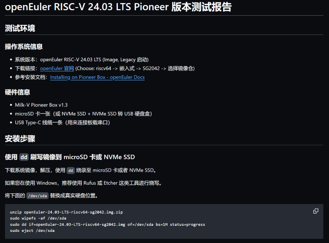

# RISC-V 开发板软件生态观测

PLCT Lab 测试团队 · 丁丑小队

<!-- _paginate: "skip" -->

---

# 我是谁 | Who am I

- PLCT Lab 测试团队 · 丁丑小队
- RISC-V 开发板软件生态联合观测 / J129 Mentor
- Previously: 第三测试小队
- GitHub [@KevinMX](https://github.com/KevinMX)
  - ~~常用 ID 后半截的 MX 其实才是本体~~

<!-- footer: "" -->

---

# 内容概述

- 2024 Summary
- 缘起
- 当下
    - RISC-V 操作系统支持矩阵
    - 自动化测试工具
        - 软件/自动化测试框架
        - 硬件工具
- 未来/许愿？

<!-- footer: "" -->

---

# 2024 Summary

- 支持矩阵项目已经覆盖/跟踪了绝大部分开发者能买得到的开发板×系统组合
    - 总计调研了约 50 款开发板，涉及到 20 余种操作系统
- 开发板 x 系统支持情况的表格现在是 CI 自动生成了
- 与 RuyiSDK packages-index 的自动更新机制已经初步就绪
- i18n (-en) 和 issue template 安排上了
- 软件/硬件自动化测试工具已经开始投入使用
- 应用软件生态观测逐步开始
    - 操作系统之外，亦对浏览器、数据库等常用软件进行测试
    - 部分已在 GitHub 公开测试报告
- 小队成员积极参与社区开源项目贡献
    - 对测试过程中遇到的各类问题向上游反馈和主动修复

---

# 缘起

---

# 当下

---

## RISC-V 操作系统支持矩阵

- 绝大多数常见的操作系统 × 开发板组合
    - Linux 发行版 & RTOS 均有覆盖
- 从零开始的系统刷写&启动流程
- 系统可用性验证
- Demo/SDK 验证
- 应用软件生态观测
- 向上游回报测试情况/issue

---

---

### 以 Milk-V Pioneer 为例

---

---

### i18n/国际化

由于支持矩阵文件多且繁杂，且有不断增加的趋势，维护所有文件的国际化是一项繁杂的工作。
- 200+ 报告且需要不断更新
- 内容多但格式固定
- *大家都不会除了 zh/en 外的语言*

采用自动化工具自动翻译现有文档到多种语言，且支持修改后翻译、增量翻译、CI 自动翻译等功能。

---

## 自动化测试框架

现有工具局限：

- 目标板开始测试时并无系统，烧录系统同样是测试内容
- 无法同时操作 ts 和 dut
- 生成报告难以处理——不记录操作过程
- 无法良好处理不同开发板 x 系统的复杂配置
- 无法兼容外设：只为测试软件，不支持采集卡、刷写设备等

---

### 现有工具局限

如想要测试一块开发板，有两种方法：
- 将控制机视为被测机，在其上运行命令
    - 工具连接 pts -> shell -> 串口程序 -> 被测机 shell
    - 这娃套的…
- 测试软件连接远程机，本地单独处理
    - 无法捕获本地 log
    - 无法处理远程系统、SSH 无法启动等情况

需要更符合此种情况的工具：为很多非常不同的 SBC 设备而生

---

### 自动化测试工具

#### 硬件

喜报：有新的硬件从社区里长出来了！

- sd-mux：远程刷写目标设备
    - 目前使用的是 [Badgerd SDWireC](https://github.com/Badger-Embedded/badgerd-sdwirec)，Apache-2.0
    - SDWireC 即将推出二代 USB 3.0 版本
    - 现在还有 sd_swap、Avoata HyperCard 可选，兼容性+?/速度++
- IPKVM：控制设备，捕获输出（实际情况是你不能指望每个系统 SSH、网络、VNC 都是好的）
    - Sipeed NanoKVM（基本上开箱即用）
    - JetKVM（最近的新众筹项目，暂时观望中）

---

#### 软件

- earlytest：早期启动支持：刷写、boot、远程命令行
- autotest：类 openQA 支持的软件测试，GUI 测试，支持 Python、JS 等更新更方便的语言
- lintestor：发行版、软件包测试

---

# 未来

> Life is too short for manual testing! - OpenQA

> ~~(Anything more than once)~~

---

- 添加对更多设备的观测
- 把「应用软件生态观测」融合进已有的操作系统支持矩阵
- Contribution Guide ~~（天呐我们怎么会忘记了这个）~~
- 继续改进现有的自动化测试工具，并与 RuyiSDK 其他组件加强协作
    

---

# 感谢大家！

###### 致谢·测试团队的各位小伙伴们，以及所有为 support-matrix 项目做过贡献的好心人们 :)

GitHub: https://github.com/ruyisdk/support-matrix