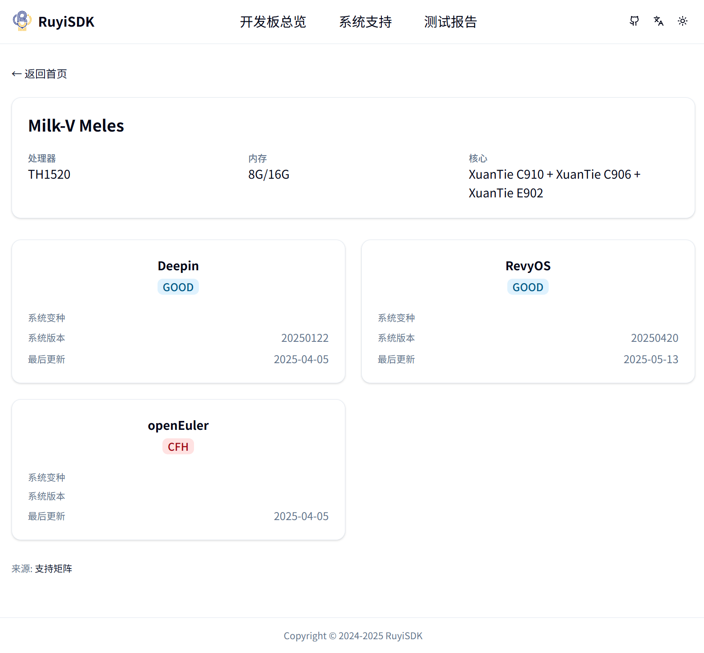
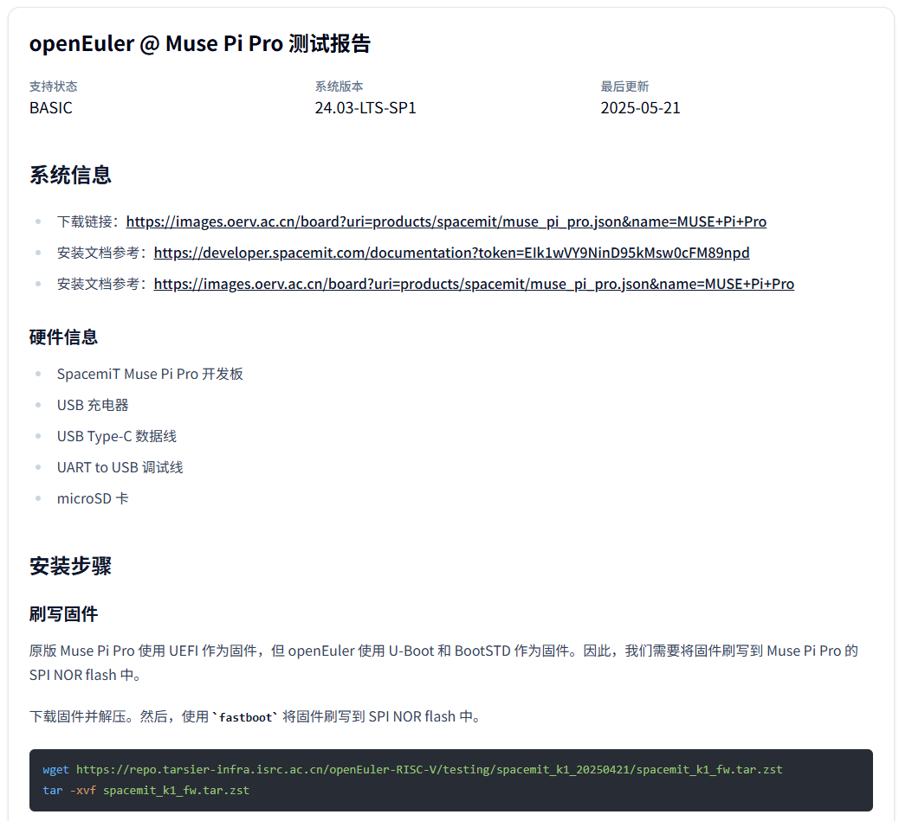
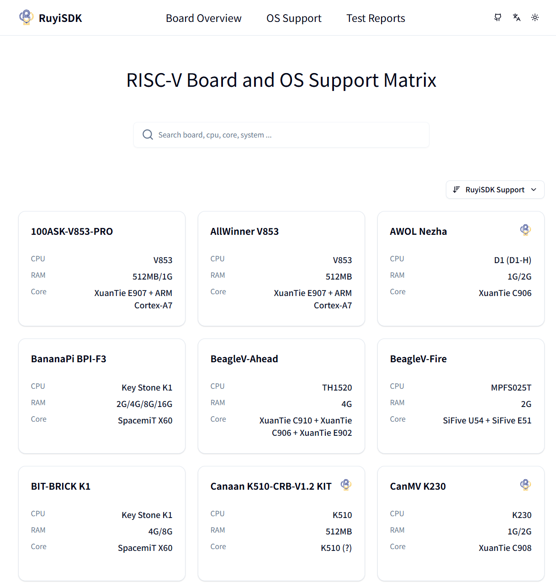
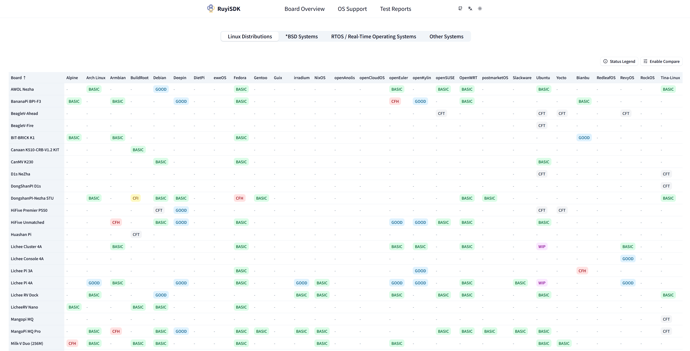

# RuyiSDK RISC-V 操作系统支持矩阵 

PLCT Lab 测试团队

<!-- _paginate: "skip" -->

---

## 内容概述

- 操作系统支持矩阵
    - 项目介绍与现状
    - 近期更新
    - 发现的问题
    - 网页前端
- GNU 工具链测试
- 自动化测试工具
    - 软件/自动化测试框架
    - 硬件工具
- 未来的计划

<!-- footer: "" -->

---

## 项目介绍

- 绝大多数常见的操作系统 × 开发板组合
    - Linux 发行版 & RTOS 等均有覆盖
- 从零开始的系统刷写&启动流程
- 系统可用性验证
- Demo/SDK 验证
- 应用软件生态观测
- 向上游回报测试情况/issue
- 为 RuyiSDK 其他项目提供数据支撑

---

### 包含内容

- 硬件信息
    - CPU / RAM / 存储 / IO 等基本设备信息
- OS 支持信息
    - Linux / BSD / RTOS 等均有测试覆盖
- 详细测试报告
    - 包括刷写步骤，方便新人上手
    - 详细的系统可用性情况
        - e.g. 仅 Shell 可用 / 有图形界面可用
        - 不可用的镜像亦会向对应社区反馈问题
---

### 测试结果评级

- GOOD: 系统提供可用的图形界面
- BASIC: 能够启动和运行，默认无图形界面，能够提供基本的控制台/命令行交互
- CFH: Call For Help
    - 官方文档/社区论坛显示该操作系统支持此开发板，但经测试启动失败
    - （会向上游社区反馈情况）
- CFT: Call For Testing
    - 有可用的操作系统镜像，但因缺乏硬件设备或其他原因暂未验证
- CFI: Call For More Information: 
    - 官方文档声称支持该操作系统，但目前没有可用的系统镜像
- WIP: Working In Progress
    - 官方公告表示将会有/正在支持该开发板，目前暂无镜像可用
- \- (N/A): 该操作系统/开发板组合没有支持，无论是官方还是其他来源

---

---

---

### 项目现状

- 支持矩阵项目已经覆盖/跟踪了绝大部分开发者能买得到的开发板×系统组合
    - 总计调研了 **73** 款开发板，涉及到 **43** 种操作系统
- 利用 CI 自动生成开发板 x 系统支持情况的表格
    - 同时自动部署至前端网站
    - 提供更好的交互体验
- 软件/硬件自动化测试工具已经开始投入使用
- 进行应用软件生态观测同步开展
    - 操作系统之外，亦对浏览器、数据库等常用软件进行测试
    - 部分已在 GitHub 公开测试报告
- 小队成员积极参与社区开源项目贡献
    - 对测试过程中遇到的各类问题向上游反馈和主动修复

---

## 近期更新

- 新增网页前端，纯文本 CSV 表格基本退出历史舞台
- 扩充了大量开发板（50 -> 73）
    - 新上市/先前未测试过的都包含在内
    - Milk-V Megrez (EIC7700X), MUSE Pi Pro (K1/M1), ...
- 扩充了测试的操作系统（20 -> 43）
    - openAnolis, openCloudOS, Guix, irradium, NixOS, ...
- 现有测试报告持续跟进上游系统最新版本进行测试
- 完善文档与社区贡献机制
- RuyiSDK 集成工具链在实机上的测试与验证

---

## 近期发现的问题

- 观测到部分开发板的部分系统可能缺乏维护
    - 部分相对较老的开发板甚至已经 EOL
    - 即使是同一 SoC 的开发板，维护情况也不尽相同
- 部分发行版/系统的新 release 在特定开发板上可能无法启动
    - e.g. Bianbu v2.2 在 K1/M1 开发板上可能启动失败
    - 发行版测试缺失？
- 主线支持仍须努力
    - Linux kernel
    - Bootloader: U-Boot / EDK2 / ...
    - GPU (**Imagination PowerVR**) / Mesa

---

## 支持矩阵网页前端

Credit: J129 实习生逄昊同学

https://matrix.ruyisdk.org

---

---

---

### 介绍

- 提供基于 WebUI 的快速查询体验
- 中英双语切换
- 可按硬件/OS 查看所需信息
- 测试报告分页显示，支持标签导航与条件过滤
- 支持不同开发板&系统支持情况比较
- 支持按开发板/系统/支持情况/最近更新跑续

---

### 近期更新

- CI 自动同步支持矩阵仓库更新
- 适配 metadata 更新
- 新增开发板比较功能
- 若干 UI 外观修复
- ...

---

## GNU 工具链测试

针对 RuyiSDK / ruyi 中集成提供的工具链，在开发板实机上进行测试。

覆盖多数常见的 CPU / IP 核：

- D1 (c906fdv)
- SpacemiT K1/M1 (X60)
- TH1520 (c910)
- JH7110 (U74)
- K230 (c908)
- SG2042 (c920)
- CV1800B (c906fdv)
- SG2000 (c906fdv)

---

### 测试报告内容

- 测试环境（系统/硬件/编译器版本等）
- 安装流程
- 典型应用场景测试
    - 编译器版本检查
    - CoreMark（原生/交叉编译）
    - Hello World

---

### 测试结果

https://github.com/QA-Team-lo/ruyisdk-gnu-tests/releases

| GCC          | D1 | K1/M1 | TH1520 | JH7110 | K230 | SG2042 | CV1800B | SG2000 |
|--------------|----|-------|--------|--------|------|--------|---------|--------|
| gnu-upstream | ✅  | ✅     | ✅      | ✅      | ✅    | ✅      | ✅       | ✅      |
| gnu-plct     | ✅  | ✅     | ✅      | ✅      | ✅    | ✅      | ✅       | ✅      |

---

### 自动化测试工具（软硬件皆有）

- earlytest：早期启动支持：刷写、boot、远程命令行
- autotest：类 openQA 支持的软件测试，GUI 测试，支持 Python、JS 等更新更方便的语言
- lintestor：发行版、软件包测试，可以实现全自动直出测试报告
- 团队成员自行开发的远程控制/开发板烧录工具 [RemoSwitch](https://github.com/wychlw/RemoSwitch)
    - 用于在上位机（读卡器）和开发板之间直接切换 microSD 卡，解决远程刷写问题，实现全自动烧录测试
    - 板载 USB-TTL 用于上位机与开发板通信
    - USB-A 电源控制
    - USB 3.0 高速读卡器
    - 软硬件设计均开源

---

# 感谢大家！

#### Any questions?

###### 致谢：测试团队的各位小伙伴们，以及所有为 support-matrix 项目直接/间接做过贡献的好心人们 :)

GitHub: https://github.com/ruyisdk/support-matrix