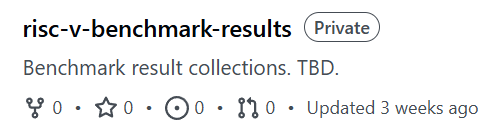

# RuyiSDK RISC-V 操作系统支持矩阵 

PLCT Lab 测试团队·丁丑小队

<!-- _paginate: "skip" -->

---

## 内容概述

- 操作系统支持矩阵
    - 项目介绍与现状
    - 近期更新
    - 发现的问题
- 支持矩阵之外的测试
- 未来的计划

<!-- footer: "" -->

---

## 项目介绍

- 绝大多数常见的操作系统 × 开发板组合
    - Linux 发行版 & RTOS 等均有覆盖
- 从零开始的系统刷写&启动流程
- 系统可用性验证
- Demo/SDK 验证
- 应用软件生态观测
- 向上游回报测试情况/issue
- 为 RuyiSDK 其他项目提供数据支撑

---

### 包含内容

- 硬件信息
    - CPU / RAM / 存储 / IO 等基本设备信息
- OS 支持信息
    - Linux / BSD / RTOS 等均有测试覆盖
- 详细测试报告
    - 包括刷写步骤，方便新人上手
    - 详细的系统可用性情况
        - e.g. 仅 Shell 可用 / 有图形界面可用
        - 不可用的镜像亦会向对应社区反馈问题
---

### 测试结果评级

- GOOD: 系统提供可用的图形界面
- BASIC: 能够启动和运行，默认无图形界面，能够提供基本的控制台/命令行交互
- CFH: Call For Help
    - 官方文档/社区论坛显示该操作系统支持此开发板，但经测试启动失败
    - （会向上游社区反馈情况）
- CFT: Call For Testing
    - 有可用的操作系统镜像，但因缺乏硬件设备或其他原因暂未验证
- CFI: Call For More Information: 
    - 官方文档声称支持该操作系统，但目前没有可用的系统镜像
- WIP: Working In Progress
    - 官方公告表示将会有/正在支持该开发板，目前暂无镜像可用
- \- (N/A): 该操作系统/开发板组合没有支持，无论是官方还是其他来源

---

---

---

### 项目现状

- 支持矩阵项目已经覆盖/跟踪了绝大部分开发者能买得到的开发板×系统组合
    - 总计调研了 **73** 款开发板，涉及到 **41** 种操作系统
- 利用 CI 自动生成开发板 x 系统支持情况的表格
    - 同时自动部署至前端网站
    - 提供更好的交互体验
- 进行应用软件生态观测同步开展
    - 操作系统之外，亦对浏览器、数据库等常用软件进行测试
    - 部分已在 GitHub 公开测试报告
- 小队成员积极参与社区开源项目贡献
    - 对测试过程中遇到的各类问题向上游反馈和主动修复

---

## 近期更新·Ⅰ

- 网页前端：现以 RISC-V 主题色呈现 + some bug fixes
    - GitHub 仓库侧 CSV 表格生成代码重构，颜色与网页端统一
- 清理了部分不再需要的 metadata
    - 修改了部分字段的定义
- CI 部分重构，移除了一些不再需要的组件
- 修正了部分发行版名称大小写错误
- 使用 `sdX` `mmcblkX` 替换真正的设备名称以避免读者误操作

---

## 近期更新·Ⅱ

测试报告例行跟进上游更新
> https://matrix.ruyisdk.org/zh-CN/reports

---

## 近期更新·Ⅲ

---

## 近期发现的问题

- 老生常谈：
    - 观测到部分开发板的部分系统可能缺乏维护
    - 部分相对较老的开发板甚至已经 EOL
    - 即使是同一 SoC 的开发板，维护情况也不尽相同
    - 主线支持仍须努力
        - Linux kernel
        - Bootloader: U-Boot / EDK2 / LinuxBoot / ...
        - GPU (**Imagination PowerVR**) / Mesa
- 部分发行版/系统的新 release 在特定开发板上可能无法启动
    - e.g. Bianbu v2.2.x & Bianbu v3.0.x 在 K1/M1 开发板上可能启动失败
    - 发行版测试缺失？

---

## Coming soon™

---

# 感谢大家！

#### Any questions?

###### 致谢：测试团队的各位小伙伴们，以及所有为 support-matrix 项目直接/间接做过贡献的好心人们 :)

GitHub: https://github.com/ruyisdk/support-matrix