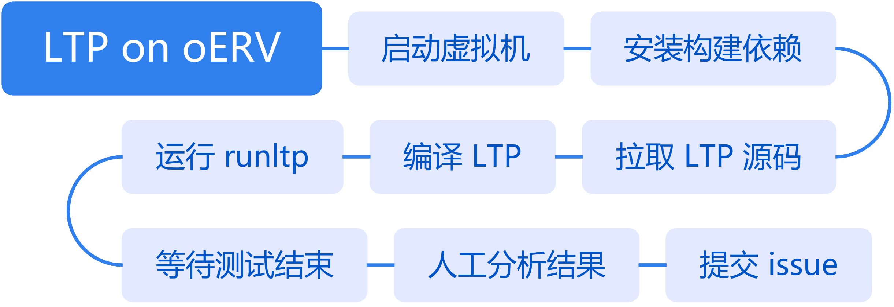

# oERV 专项测试拾遗：次世代 LTP 执行器 Kirk

PLCT Lab 第三测试小队 Kevin.MX

<!-- _footer: "" -->

---

# 内容概述

- openEuler 专项测试介绍
- LTP & Kirk 介绍
- 为什么需要新的测试执行器
- 如何使用 Kirk
- 一些已知问题
- 未来还需要做的事情……？

---

# openEuler 专项测试

## 必要性？

- 面向数字基础设施的开源操作系统
- 有大量下游商业发行版
- 有严格的质量保障体系
    - 功能/性能/安全/虚拟化/内核/长稳/兼容性/etc
- SIG-QA 测试工具 
    - RadiaTest, Compass CI, mugen, etc
- RISC-V 合入主线支持

---

# LTP

全称 Linux Test Project，是由 SGI 发起，和 OSDL 和 Bull 等联合开发的项目，并由 IBM, Cisco, Fujitsu, SUSE, Red Hat, Oracle 等维护，其目的是向开源社区提供用于验证 Linux 可靠性、健壮性和稳定性的测试套件。自 2001 年四月初次发布至今，项目本身已有二十余年历史。
截止 20230929 版本，LTP 已经有：

- 33 个测试套
- 2411 个测试用例
- 约两万个测试点（计入结果统计的功能、标志、返回值等测试）

Homepage: https://linux-test-project.github.io/
GitHub: [linux-test-project/ltp](https://github.com/linux-test-project/ltp)
laokz - OERV LTP 测试简介 | [av824186799](https://www.bilibili.com/video/av824186799)

---

# Kirk

Kirk 是 [runltp-ng](https://github.com/linux-test-project/runltp-ng) 的一个分支，目标是将多个 Linux 测试框架整合进一个工具中，提供 QEMU, SSH, LTX 远程测试能力，同时也允许并发执行测试用例。

Kirk 于 LTP 20230929 版本正式取代 runltp-ng，随 LTP 一起发布。

GitHub: [linux-test-project/kirk](https://github.com/linux-test-project/kirk)

---

# 目前的 oERV LTP 测试方式（23.03 ~ 23.09）

---

# 为什么需要新的测试执行器

缘起「发生甚么事了」

---

# runltp 本身存在的问题

<!-- _paginate: false -->
<!-- footer: '' -->

> Andrea Cervesato at SUSE Labs Conference 2022:

- 仅能在受测机上运行，无法处理 kernel panic/oops
- 代码混乱，难以阅读，甚至难以调试（bash + C）
- 生成的报告难以解析（logs + HTML）
- 部分选项和功能使用率很低

2014 年 LTP 引入了一套新的 API，总计约 5700 个 commit，其中与 runltp 相关的仅仅 31 个。

---

