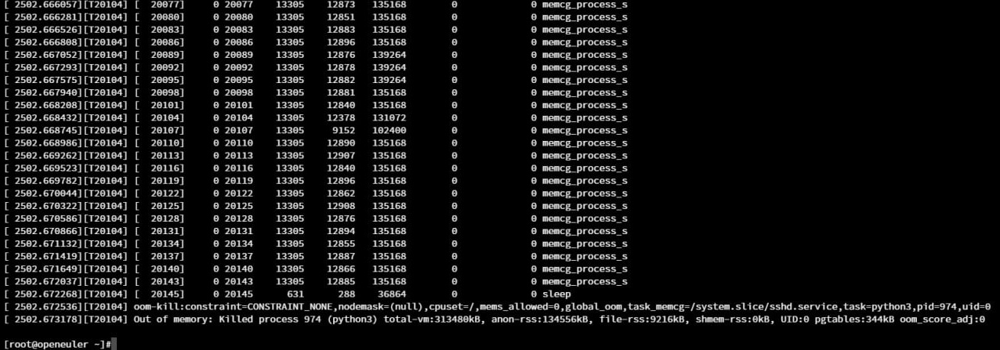

# oERV 专项测试拾遗：次世代 LTP 执行器 Kirk

PLCT Lab 第三测试小队 郑景坤

<!-- _footer: "" -->
<!-- _paginate: "skip" -->

---

# 内容概述

- openEuler 专项测试介绍
- LTP & Kirk 介绍
- 为什么需要新的测试执行器
- 如何使用 Kirk
- 一些已知问题

---

<!-- _paginate: false -->
<!-- footer: '' -->

# openEuler 专项测试

## 必要性？

- 面向数字基础设施的开源操作系统
- 有大量下游商业发行版
- 有严格的质量保障体系
    - 功能/性能/安全/虚拟化/内核/长稳/兼容性/etc
- SIG-QA 测试工具 
    - RadiaTest, Compass CI, mugen, etc
- RISC-V 合入主线支持

---

# LTP

全称 Linux Test Project，是由 SGI 发起，和 OSDL 和 Bull 等联合开发的项目，并由 IBM, Cisco, Fujitsu, SUSE, Red Hat, Oracle 等维护，其目的是向开源社区提供用于验证 Linux 可靠性、健壮性和稳定性的测试套件。自 2001 年四月初次发布至今，项目本身已有二十余年历史。
截止 20230929 版本，LTP 已经有：

- 33 个测试套
- 2411 个测试用例
- 约两万个测试点（计入结果统计的功能、标志、返回值等测试）

Homepage: https://linux-test-project.github.io/
GitHub: [linux-test-project/ltp](https://github.com/linux-test-project/ltp)
laokz - OERV LTP 测试简介 | [av824186799](https://www.bilibili.com/video/av824186799)

---

# 目前的 oERV LTP 测试方式（23.03 ~ 23.09）


---

# 为什么需要新的测试执行器

缘起 ·「发生甚么事了」


---

# runltp 本身存在的问题

> Andrea Cervesato at SUSE Labs Conference 2022:

- 仅能在受测机上运行，无法处理 kernel panic/oops
- 代码混乱，难以阅读，甚至难以调试（bash + C）
- 生成的报告难以解析（logs + HTML）
- 部分选项和功能使用率很低

2014 年 LTP 引入了一套新的 API，总计约 5700 个 commit，其中与 runltp 相关的仅仅 31 个。

---

# Kirk

Kirk 是 [runltp-ng](https://github.com/linux-test-project/runltp-ng) 的一个分支，目标是将多个 Linux 测试框架整合进一个工具中，提供 QEMU, SSH, LTX 远程测试能力，同时也允许并发执行测试用例。

Kirk 于 LTP 20230929 版本正式取代 runltp-ng，随 LTP 一起发布。

GitHub: [linux-test-project/kirk](https://github.com/linux-test-project/kirk)

---

```bash
Kirk - All-in-one Linux Testing Framework

options:
  -h, --help            show this help message and exit
  --version, -V         Print current version
  --verbose, -v         Verbose mode
  --no-colors, -n       If defined, no colors are shown
  --tmp-dir TMP_DIR, -d TMP_DIR
                        Temporary directory
  --restore RESTORE, -R RESTORE
                        Restore a specific session
  --env ENV, -e ENV     List of key=value environment values separated by ':'
  --skip-tests SKIP_TESTS, -i SKIP_TESTS
                        Skip specific tests
  --skip-file SKIP_FILE, -I SKIP_FILE
                        Skip specific tests using a skip file (newline separated item)
  --suite-timeout SUITE_TIMEOUT, -T SUITE_TIMEOUT
                        Timeout before stopping the suite
  --exec-timeout EXEC_TIMEOUT, -t EXEC_TIMEOUT
                        Timeout before stopping a single execution
  --run-suite [RUN_SUITE ...], -r [RUN_SUITE ...]
                        List of suites to run
  --run-command RUN_COMMAND, -c RUN_COMMAND
                        Command to run
  --workers WORKERS, -w WORKERS
                        Number of workers to execute tests in parallel
  --force-parallel, -p  Force parallelization execution of all tests
  --sut SUT, -s SUT     System Under Test parameters. For help please use '-s help'
  --framework FRAMEWORK, -f FRAMEWORK
                        Framework parameters. For help please use '-f help'
  --json-report JSON_REPORT, -j JSON_REPORT
                        JSON output report
```
---

#### 简单小热身

在本机环境上运行 `math` 测试套：

```bash
[openeuler@openeuler ltp]$ ./kirk -r math
Host information

        System: Linux
        Node: openeuler
        Kernel Release: 6.4.0-10.1.0.20.oe2309.riscv64
        Kernel Version: #1 SMP Sat Oct  7 06:19:28 UTC 2023
        Machine Architecture: riscv64
        Processor: riscv64

        Temporary directory: /tmp/kirk.openeuler/tmpggkjfvry

Connecting to SUT: host
Starting suite: math
abs01: pass  (0.209s)
atof01: pass  (0.148s)
float_bessel: pass  (15.960s)
float_exp_log: pass  (10.219s)
float_iperb: pass  (4.228s)
float_power: pass  (8.152s)
float_trigo: pass  (10.339s)
fptest01: pass  (0.081s)
fptest02: pass  (0.085s)
nextafter01: pass  (0.068s)

                                                                                                                                
Execution time: 55.786s
```

---                  

```bash
Suite Name: math
Total Run: 10
Total Runtime: 49.490s
Passed Tests: 22
Failed Tests: 0
Skipped Tests: 0
Broken Tests: 0
Warnings: 0
Kernel Version: Linux 6.4.0-10.1.0.20.oe2309.riscv64 #1 SMP Sat Oct  7 06:19:28 UTC 2023
CPU: riscv64
Machine Architecture: riscv64
RAM: 8120392 kB
Swap memory: 0 kB
Distro: openEuler
Distro Version: 23.09


Disconnecting from SUT: host
[openeuler@openeuler ltp]$ 
```

---

#### 想看详细输出？没问题！

```bash
[openeuler@openeuler ltp]$ ./kirk -r math -v
Host information

        System: Linux
        Node: openeuler
        Kernel Release: 6.4.0-10.1.0.20.oe2309.riscv64
        Kernel Version: #1 SMP Sat Oct  7 06:19:28 UTC 2023
        Machine Architecture: riscv64
        Processor: riscv64

        Temporary directory: /tmp/kirk.openeuler/tmpntdda51f

Connecting to SUT: host
Starting suite: math

===== abs01 =====
command: abs01 
abs01       1  TPASS  :  Test passed
abs01       2  TPASS  :  Test passed
abs01       3  TPASS  :  Test passed

Summary:
passed    3
failed    0
broken    0
skipped   0
warnings  0

Duration: 0.052s
```

---

#### 输出 json 文件

```bash
$ ./kirk -r math -v -j ~/report.json
```


```json
{
            "test_fqn": "nextafter01",
            "status": "fail",
            "test": {
                "command": "nextafter01",
                "arguments": [],
                "log": "nextafter01    1  TPASS  :  Test passed\nnextafter01    2  TPASS  :  Test passed\nnextafter01    3  TPASS  :  Test passed\n",
                "retval": [
                    "0"
                ],
                "duration": 0.05034971237182617,
                "failed": 0,
                "passed": 3,
                "broken": 0,
                "skipped": 0,
                "warnings": 0,
                "result": "fail"
            }
        }
    ],
    "stats": {
        "runtime": 48.59621572494507,
        "passed": 22,
        "failed": 0,
        "broken": 0,
        "skipped": 0,
        "warnings": 0
    },
    "environment": {
        "distribution": "openEuler",
        "distribution_version": "23.09",
        "kernel": "Linux 6.4.0-10.1.0.20.oe2309.riscv64 #1 SMP Sat Oct  7 06:19:28 UTC 2023",
        "arch": "riscv64",
        "cpu": "riscv64",
        "swap": "0 kB",
        "RAM": "8120392 kB"
    }
```

---

#### 从中断处恢复执行

```bash
[openeuler@openeuler ltp]$ ls -alh /tmp/kirk.openeuler/
total 0
drwxr-xr-x  7 openeuler openeuler 160 Dec 14 02:01 .
drwxrwxrwt 11 root      root      220 Dec 14 01:56 ..
lrwxrwxrwx  1 openeuler openeuler  31 Dec 14 02:01 latest -> /tmp/kirk.openeuler/tmpzob_dpo
[openeuler@openeuler ltp]$ cat /tmp/kirk.openeuler/latest/executed 
math::abs01
math::atof01
```

```bash
$ ./kirk -r math -R /tmp/kirk.openeuler/latest/
```

---

## 利用 Kirk 提供的 SUTs (System Under Tests) 进行测试

```bash
./kirk -s help
--sut option supports the following syntax:

        <name>:<param1>=<value1>:<param2>=<value2>:..

Supported plugins: | host | ltx | qemu | ssh | 

host has not configuration

ltx configuration:
        stdin: transport stdin file
        stdout: transport stdout file

qemu configuration:
        image: qemu image location
        kernel: kernel image location
        initrd: initrd image location
        user: user name (default: '')
        password: user password (default: '')
        prompt: prompt string (default: '#')
        system: system architecture (default: x86_64)
        ram: RAM of the VM (default: 2G)
        smp: number of CPUs (default: 2)
        serial: type of serial protocol. isa|virtio (default: isa)
        virtfs: directory to mount inside VM
        options: user defined options

ssh configuration:
        host: IP address of the SUT (default: localhost)
        port: TCP port of the service (default: 22)
        user: name of the user (default: root)
        password: root password
        timeout: connection timeout in seconds (default: 10)
        key_file: private key location
        reset_command: command to reset the remote SUT
        sudo: use sudo to access to root shell (default: 0)
```

---

### 直接使用 Kirk 调用 QEMU

需要先对虚拟机镜像进行处理，添加串口配置：

- 编辑 `/etc/default/grub`，向 `GRUB_CMDLINE_LINUX` 中添加
    - `console=$tty_name, console=tty0`
- 重新生成 GRUB 配置
    - `grub-mkconfig -o /boot/grub/grub.cfg`

使用 Kirk 启动虚拟机执行测试：
```bash
$ kirk -r $testsuite -s qemu:image=image.qcow2
```

\* QEMU SUT 目前在 oERV 不可用。

---

### 使用 SSH 连接至远端机器进行测试

```bash
$ kirk -r $testsuite -s ssh:host=$host:port=$port:user=$user:password=$password:key_file=~/.ssh/id_rsa:reset_command=reboot
```

#### 前置条件

- 手动安装 `asyncssh` 包：`pip install asyncssh`（推荐在 venv 中进行）
- SSH 通过公私钥鉴权，需要在受测机上先行配置主控机公钥（`~/.ssh/authorized_keys`）
- 需要先行在主控机上连接一次受测机/添加至 `known_hosts`
- 需要受测机已安装有 LTP 且安装路径为默认的 `/opt/ltp`
    - 是的，Kirk 现在还不能直接通过 SSH 把测试用例传输到受测机直接执行
    - 如果有这个需求，需要使用 QEMU SUT 并通过 `virtfs` 选项直接将 LTP 目录挂载进虚拟机内

---

## 已知问题

- 使用 Kirk 代替 runltp 直接在本机运行时，由于部分测试用例会触发 OOM，</br> 可能会把 Kirk 进程杀死导致测试中断



---

## 已知问题

- QEMU SUT 目前暂时无法启动 openEuler RISC-V 虚拟机
- SSH SUT 仍需要受测机已安装 LTP
- 在同一台机器上并行运行测试用例可能会导致软死锁或内核崩溃（不推荐此用法）

---

<!-- _footer: "" -->
<!-- _paginate: "skip" -->

# 谢谢大家！